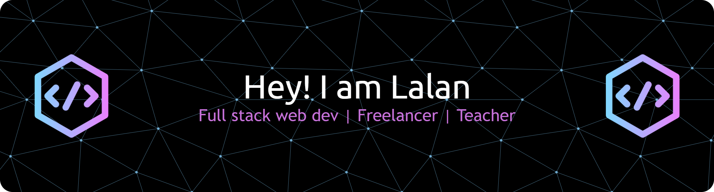

# 💫 About Me:
🚀 Hey there, welcome to my GitHub! 🌱 I'm a curious coder on a journey to explore cutting-edge tech and craft projects that make a difference. 💡 Whether it's a small idea or a big innovation — I'm always building, learning, and growing.

## 🌐 Connect with me:
  

# 💻 Tech Stack:
                       
# 📊 GitHub Stats:
 
---

<!-- Proudly created with GPRM ( https://gprm.itsvg.in ) -->